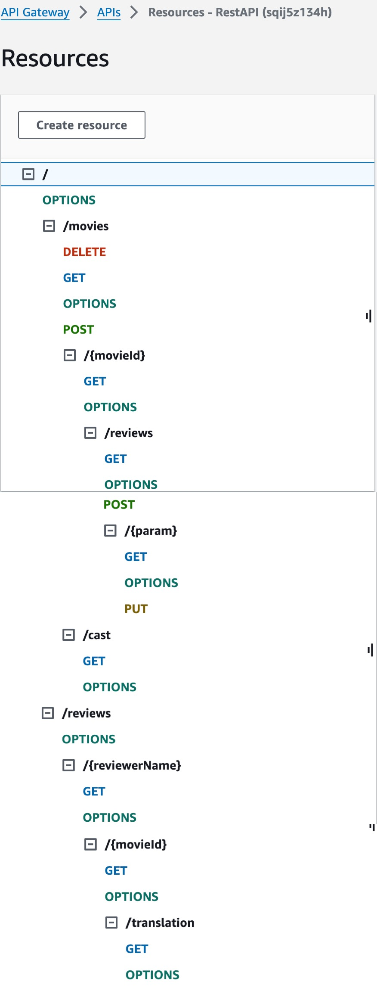
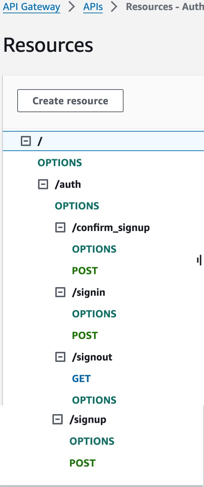
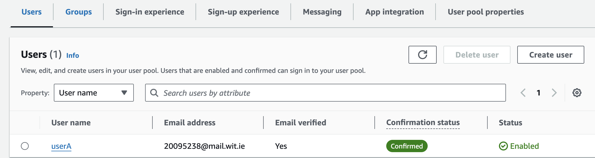
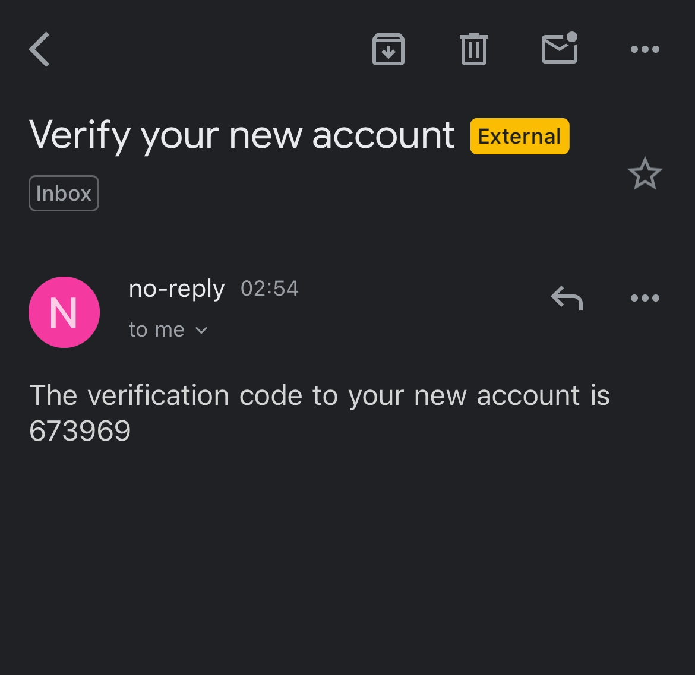

# Serveless Assignment One 

__Student Name:__ Yangqing Li
__YouTube Video link:__ 

# This project contains content
Design and develop a secure, serverless Web API for managing movie review posts, and host this API on the AWS platform, using the CDK framework to configure infrastructure resources. The API will support a range of endpoints, including adding, fetching, and updating movie reviews, as well as supporting user authentication and review translation.

## Add Web API 

POST /movies/reviews - add a movie review.
GET /movies/{movieId}/reviews - Get all the reviews for the specified movie.
GET /movies/{movieId}/reviews?minRating=n - Get the reviews for the specified movie with a rating greater than the minRating.
GET /movies/{movieId}/reviews/{reviewerName} - Get the review written by the named reviewer for the specified movie.
PUT /movies/{movieId}/reviews/{reviewerName} - Update the text of a review.
GET /movies/{movieId}/reviews/{year} - Get the reviews written in a specific year for a specific movie.
GET /reviews/{reviewerName} - Get all the reviews written by a specific reviewer.
GET /reviews/{reviewerName}/{movieId}/translation?language=code - Get a translated version of a movie review using the movie ID and reviewer name as the identifier.

## Authentication content

__User SignUp__
__User Confirm SignUp__
__User SignIn__
__User SignOut__

# Independent Study

__Get familiar with API operations:__ 
AWS Translate provides several API operations, including TranslateText (to translate text in real time) and StartTextTranslationJob (to start batch text translation jobs).
__Set up the API request:__
Each API request needs to specify the source language code, the target language code, and the text to be translated
__Configure authentication and authorization:__
Create appropriate roles and policies through AWS Identity and Access Management (IAM)

